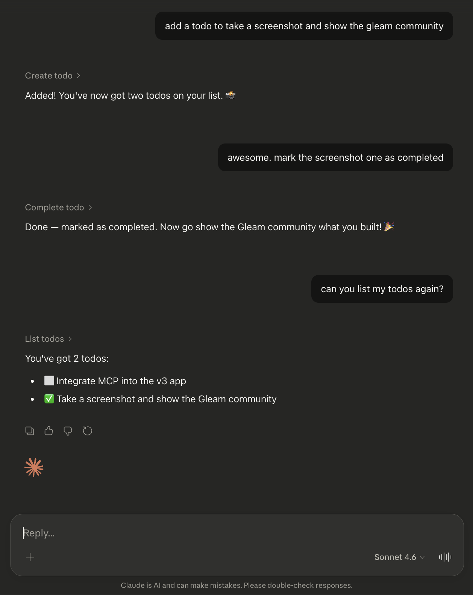
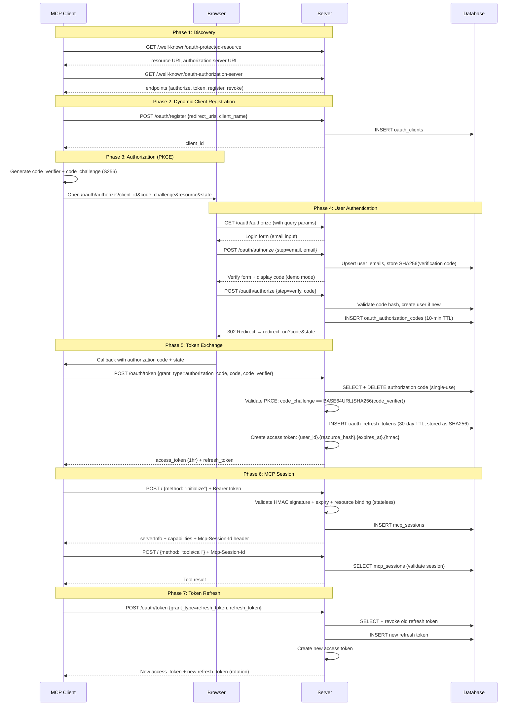

# Gleam MCP Todo

A minimal MCP (Model Context Protocol) server with OAuth 2.1, built in Gleam on the BEAM.



## What This Is

An MCP remote server that AI clients (Claude Desktop, Cursor, Claude Code) can connect to via a single URL. It implements:

- **MCP Streamable HTTP** transport with JSON-RPC 2.0
- **OAuth 2.1** with PKCE, Dynamic Client Registration (RFC 7591), and discovery metadata (RFC 9728/8414)
- **Magic-link auth** — passwordless login via email verification code (displayed on screen for demo)
- **Todo CRUD** as example MCP tools (list, get, create, update, complete, delete)

## OAuth 2.1 Flow

Here's what happens when you add this server to Claude Desktop and use it for the first time:

**1. Claude Desktop connects — `POST /` (no auth)**
The first time Claude needs a tool, it sends a JSON-RPC `initialize` request to `/` with no token. The server responds **401** with a `WWW-Authenticate` header pointing to `/.well-known/oauth-protected-resource`.

**2. OAuth discovery**
Claude Desktop fetches `/.well-known/oauth-protected-resource` and `/.well-known/oauth-authorization-server` to learn the endpoint URLs (authorize, token, register, revoke).

**3. Dynamic client registration — `POST /oauth/register`**
Claude Desktop registers itself, sending its callback URI. Gets back a `client_id` (no secret — public client, per OAuth 2.1).

**4. Authorization — browser opens `/oauth/authorize`**
Claude Desktop generates a PKCE `code_verifier`/`code_challenge` pair and opens your browser to the authorize endpoint. You see a **login form** asking for your email.

**5. Email verification (demo mode)**
You enter your email. The server generates a 5-character code from an unambiguous alphabet (no `0/O`, `1/I/l`), hashes it, and displays it on screen. You type it back in to prove you're the same browser session. In production, the code would be sent via email (or SMS) instead of displayed — the server-side flow is identical, you'd just swap the "show code on screen" step for a call to an email provider like SES, Postmark, or Resend. The verify form would say "check your email" instead of showing the code.

**6. Authorization code redirect**
After verifying the code, the server creates your user account (if new), generates a single-use authorization code (10-minute TTL), and **302 redirects** back to Claude Desktop's callback URL.

**7. Token exchange — `POST /oauth/token`**
Claude Desktop exchanges the authorization code + `code_verifier` for tokens. The server validates PKCE, deletes the auth code, and returns an **access token** (1-hour, HMAC-signed, stateless) and a **refresh token** (30-day, stored as SHA-256 hash in DB).

**8. MCP session — `POST /` (with Bearer token)**
Claude Desktop retries the `initialize` request with the access token. The server validates the signature, creates an MCP session, and returns a `Mcp-Session-Id` header. All subsequent requests use this session ID.

**9. Tool calls**
Claude Desktop calls tools (`list_todos`, `create_todo`, etc.) via JSON-RPC with the session ID. The server looks up the session to identify the user and dispatches to the tool handler.

**10. Token refresh**
When the access token expires, Claude Desktop sends the refresh token to `/oauth/token`. The server revokes the old refresh token and issues new tokens (rotation).



## Quick Start

```bash
cp .env.example .env
bin/reset
bin/server
# Visit http://localhost:8080 for setup instructions
```

## Connect an MCP Client

**Claude.ai (Web):** Settings → Connectors → Add custom connector → paste your server URL → click Add. Then in a conversation, click **+** (lower left) → **Connectors** to enable it. Requires Pro, Max, Team, or Enterprise plan (beta).

**Claude Code:**
```bash
claude mcp add --transport http gleam-mcp-todo http://localhost:8080
```

Replace `http://localhost:8080` with your deployed URL if running remotely.

The client handles the OAuth flow automatically — you'll see a browser window for email verification.

## Testing

```bash
bin/test    # 50 tests
```

Tests use in-memory SQLite with clone-based isolation (via SQLite's backup API), so each test gets a fresh database.

## Rate Limiting

The email verification flow is rate-limited to prevent abuse. Both magic link requests and verification code attempts have layered fixed-window limits (per-minute, per-15-minutes, per-hour, per-day) enforced via ETS atomic counters on the BEAM. No database overhead, no external dependencies.

Rate limiting uses [glimit](https://github.com/pairshaped/glimit) (our fork at `lib/glimit`) which provides the `glimit/window` module for fixed-window counters.

## Project Structure

```
gleam-mcp-todo/
├── src/
│   ├── gleam_mcp_todo.gleam             # Entrypoint
│   └── gleam_mcp_todo/
│       ├── router.gleam            # Route dispatch, bearer auth
│       ├── mcp.gleam               # JSON-RPC 2.0 types and builders
│       ├── mcp_handler.gleam       # MCP protocol handler (init, tools, sessions)
│       ├── mcp_tools.gleam         # Tool implementations (todo CRUD)
│       ├── oauth.gleam             # OAuth 2.1 endpoints (register, token, revoke)
│       ├── auth.gleam              # Token create/validate (HMAC-signed)
│       ├── todos.gleam             # Todo business logic and validation
│       ├── context.gleam           # App context type
│       ├── db.gleam                # Parrot-to-sqlight query bridge
│       ├── rate_limiter.gleam       # Rate limiting (glimit/window wrapper)
│       ├── cleanup.gleam           # Periodic cleanup of expired tokens/sessions
│       ├── time.gleam              # System time FFI
│       ├── sql.gleam               # Generated by Parrot (do not edit)
│       └── pages/
│           ├── layout.gleam        # SSR HTML layout (Lustre + Bootstrap)
│           ├── setup_page.gleam    # MCP client config instructions
│           └── oauth_page.gleam    # OAuth authorize/verify forms
├── src/sql/                        # Parrot-annotated SQL files
├── db/migrations/                  # SQLite migrations (one per table)
├── bin/                            # Dev scripts (build, test, server, migrate, reset, deploy)
├── Dockerfile                      # Multi-stage build (compile + slim runtime)
├── compose.yml                     # Docker Compose (app + Caddy reverse proxy)
└── Caddyfile                       # Auto-HTTPS via Let's Encrypt
```

## Deployment

### Ansible (recommended)

Uses capistrano-style release directories with atomic symlink swaps. Each deploy creates a new timestamped release, builds in isolation, then swaps a `current` symlink. Rollback repoints the symlink without rebuilding.

```
/home/deploy/gleam-mcp-todo/
  releases/
    20260324_143012/   # each deploy = git clone + gleam build
    20260324_151530/
  current -> releases/20260324_151530/   # what systemd runs
  shared/
    .env               # persists across deploys
    db/gleam_mcp_todo.db
```

**First-time setup:**
```bash
# 1. Copy and configure vars
cp ansible/vars.yml.example ansible/vars.yml
# Edit ansible/vars.yml with your domain, repo URL, etc.

# 2. Provision the server (run as root for the first time)
ansible-playbook ansible/setup.yml -i ansible/inventory.ini -e ansible_user=root
```

**Deploy and rollback:**
```bash
bin/deploy           # deploy latest main
bin/deploy v1.2.0    # deploy a specific tag
bin/deploy abc123    # deploy a specific commit
bin/rollback         # roll back to previous release (no rebuild)
```

Keeps 5 releases. Rollback is instant — just a symlink swap + restart.

**Setup notes:**
- After the first run, `setup.yml` disables root SSH login. If you need to re-run setup, use `--start-at-task="Install ufw"` to skip Play 1 (the bootstrap play).
- If you rebuild the server, clear the old host key first: `ssh-keygen -R <ip>` then `ssh-keyscan -H <ip> >> ~/.ssh/known_hosts`.

### Docker

```bash
bin/deploy-docker    # pull, rebuild containers, restart
```

### esqlite and build caching

The build bottleneck is esqlite — it compiles a C NIF for SQLite (~27s). `gleam export erlang-shipment` always does a clean build, recompiling esqlite every time. Both deploy methods work around this by using `gleam build` instead, which supports incremental compilation and skips esqlite on subsequent builds.

**Ansible** uses `gleam build` directly on the server. Each release gets a fresh `git clone`, so esqlite recompiles on each deploy. Subsequent builds within the same release are incremental.

**Docker** needs an extra trick because `COPY src/` invalidates the layer cache and `gleam build` starts fresh. The Dockerfile uses a **dummy source step**: before copying real source, it creates a minimal `pub fn main() { Nil }` stub and runs `gleam build` to compile all deps into a cached layer. This layer only rebuilds when `gleam.toml` or `manifest.toml` change. When real source is copied in, the final `gleam build` only recompiles the app module (~0.25s). Note that `gleam deps download` alone isn't enough — it fetches source packages without compiling them or their NIFs.

The runtime image includes Gleam and source files (not just an erlang-shipment) because `gleam build` produces incremental build artifacts that `gleam run` needs.

## Dependencies

| Package | Description | Docs |
|---|---|---|
| [wisp](https://hexdocs.pm/wisp/) | Web framework | [hexdocs](https://hexdocs.pm/wisp/) |
| [mist](https://hexdocs.pm/mist/) | HTTP server (Erlang/OTP) | [hexdocs](https://hexdocs.pm/mist/) |
| [lustre](https://hexdocs.pm/lustre/) | HTML rendering (SSR only) | [hexdocs](https://hexdocs.pm/lustre/) |
| [sqlight](https://hexdocs.pm/sqlight/) | SQLite bindings | [hexdocs](https://hexdocs.pm/sqlight/) |
| [parrot](https://hexdocs.pm/parrot/) | SQL code generation | [hexdocs](https://hexdocs.pm/parrot/) |
| [glimit](https://github.com/pairshaped/glimit) | Rate limiting (fork with ETS + window counters) | [hexdocs](https://hexdocs.pm/glimit/) |
| [envoy](https://hexdocs.pm/envoy/) | Environment variables | [hexdocs](https://hexdocs.pm/envoy/) |
| [dot_env](https://hexdocs.pm/dot_env/) | .env file loading | [hexdocs](https://hexdocs.pm/dot_env/) |
| [logging](https://hexdocs.pm/logging/) | Structured logging | [hexdocs](https://hexdocs.pm/logging/) |
| [simplifile](https://hexdocs.pm/simplifile/) | File operations | [hexdocs](https://hexdocs.pm/simplifile/) |
| [unitest](https://hexdocs.pm/unitest/) | Test framework | [hexdocs](https://hexdocs.pm/unitest/) |
